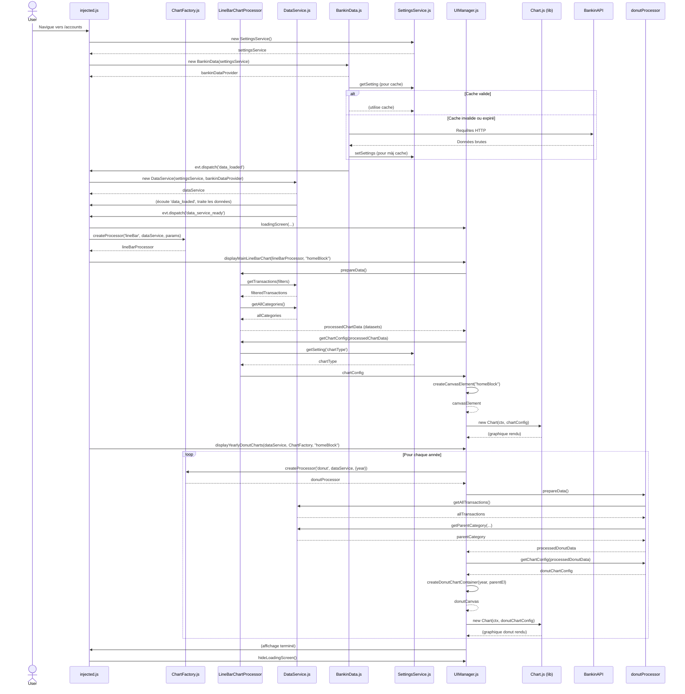

# Architecture de l'Extension Chrome Bankin' Charts Enhancer

Cette document décrit l'architecture logicielle de l'extension Chrome Bankin' Charts Enhancer. L'objectif est de fournir une vue d'ensemble des principaux composants, de leurs interactions, et du flux de données.

## Table des Matières
- [Vue d'Ensemble](#vue-densemble)
- [Principaux Modules](#principaux-modules)
    - [Core Services](#core-services)
    - [Chart Processing](#chart-processing)
    - [UI Management](#ui-management)
    - [Injection & Orchestration](#injection--orchestration)
- [Flux de Données Typique](#flux-de-données-typique)
- [Ajouter un Nouveau Type de Graphique](#ajouter-un-nouveau-type-de-graphique)
- [Schémas](#schémas)

## Vue d'Ensemble

L'extension est conçue pour récupérer les données financières de Bankin', les traiter, et afficher des visualisations graphiques enrichies sur l'interface web de Bankin'. L'architecture vise la modularité, la testabilité et la facilité d'extension.

## Principaux Modules

Voici les modules clés de l'application :

### Core Services

*   **`SettingsService.js`**:
    *   **Rôle**: Gère tous les paramètres de l'extension stockés via `chrome.storage.local`.
    *   **Responsabilités**: Charger, sauvegarder, fournir un accès typé aux configurations (plages de dates, comptes sélectionnés, état du cache, type de graphique par défaut, etc.). Notifie les autres modules des changements de paramètres via des événements (`settings_reloaded`).
*   **`BankinData.js`**:
    *   **Rôle**: Responsable de la communication avec l'API (simulée ou réelle) de Bankin' pour récupérer les données brutes.
    *   **Responsabilités**: Gérer les requêtes API (authentification, headers), implémenter la logique de pagination, et mettre en cache les données récupérées (transactions, catégories, comptes) via `SettingsService` pour minimiser les appels API. Déclenche l'événement `data_loaded` une fois les données disponibles.
*   **`DataService.js`**:
    *   **Rôle**: Point d'accès centralisé et service de traitement pour les données de l'application. Agit comme une couche d'abstraction au-dessus de `BankinData` et `SettingsService`.
    *   **Responsabilités**: S'initialise en écoutant `data_loaded` de `BankinData`. Stocke et prétraite les données brutes (transactions, catégories, comptes). Fournit des méthodes d'accès aux données (ex: `getAllTransactions`, `getAllCategories`, `getTransactions` avec filtres). Offre des utilitaires pour la manipulation des données (ex: `getParentCategory`, `aggregateByCategory`).

### Chart Processing

*   **`AbstractChartProcessor.js`**:
    *   **Rôle**: Classe de base abstraite définissant le contrat pour tous les processeurs de graphiques spécifiques.
    *   **Responsabilités**: Définit les méthodes clés `async prepareData()` (pour transformer les données brutes en un format adapté au graphique) et `getChartConfig(processedData)` (pour générer la configuration Chart.js spécifique). Prend une instance de `DataService` et des `chartSpecificParams` dans son constructeur.
*   **Processeurs Concrets (`LineBarChartProcessor.js`, `SankeyChartProcessor.js`, `DonutChartProcessor.js`)**:
    *   **Rôle**: Chaque classe hérite de `AbstractChartProcessor` et implémente la logique spécifique pour un type de graphique donné.
    *   **Responsabilités**:
        *   `prepareData()`: Utilise `DataService` pour obtenir les données nécessaires, applique des filtres et transformations spécifiques au graphique (agrégation, structuration), et retourne des données prêtes pour la visualisation Chart.js.
        *   `getChartConfig(processedData)`: Prend les données préparées et retourne l'objet de configuration complet pour Chart.js, incluant le type de graphique, les options, les datasets formatés, les tooltips, etc.
*   **`ChartFactory.js`**:
    *   **Rôle**: Centralise la création des instances de `ChartProcessor`.
    *   **Responsabilités**: Fournit une méthode statique `createProcessor(chartType, dataService, chartSpecificParams)` qui retourne l'instance du processeur de graphique approprié en fonction du `chartType` demandé. Découple le code client de la connaissance des classes de processeurs concrètes.

### UI Management

*   **`UIManager.js`**:
    *   **Rôle**: Gère toutes les interactions avec le DOM, la création des éléments d'interface utilisateur pour les graphiques, et le rendu des graphiques Chart.js.
    *   **Responsabilités**: Créer/manipuler les éléments canvas et leurs conteneurs, afficher les écrans de chargement (`loadingScreen`, `hideLoadingScreen`), injecter les graphiques dans la page aux emplacements corrects. Contient des méthodes d'affichage de haut niveau comme `displayMainLineBarChart`, `displayYearlyDonutCharts`, `displaySankeyChart`. Ces méthodes orchestrent l'utilisation d'un `ChartProcessor` (pour obtenir données et config) et de `buildChart` (pour le rendu effectif). Utilise `window.Chart` pour instancier les graphiques. Fournit des utilitaires DOM comme `parseColorCSS`.

### Injection & Orchestration

*   **`injected.js`**:
    *   **Rôle**: Point d'entrée principal de l'extension qui s'exécute dans le contexte des pages Bankin'. Orchestrateur de haut niveau.
    *   **Responsabilités**: Initialiser les services fondamentaux (`SettingsService`, `BankinData`, `DataService`) et `ChartFactory`. Détecter les changements d'URL. En fonction de l'URL et du contexte (page `/accounts` ou `/categories`), coordonner avec `ChartFactory` et `UIManager` pour afficher les graphiques appropriés. Gérer les événements globaux de l'extension via `Evt.js`.
*   **`Evt.js`**:
    *   **Rôle**: Système d'événements simple (publish/subscribe) pour la communication découplée entre les modules (ex: `data_loaded`, `settings_reloaded`).

## Flux de Données Typique (Exemple: Affichage du graphique Ligne/Barre)

1.  L'utilisateur navigue vers `https://app2.bankin.com/accounts`.
2.  `injected.js` détecte le changement d'URL (ou est exécuté au chargement de la page).
3.  `injected.js` initialise `SettingsService`, `BankinData` (qui, à son tour, charge les données via API ou cache, les stocke via `SettingsService`, puis émet `data_loaded`), et `DataService` (qui écoute `data_loaded` et traite les données brutes).
4.  Une fois les services prêts (implicitement après `data_loaded` et `data_service_ready`), la fonction `build()` dans `injected.js` est exécutée.
5.  Pour la page `/accounts`, `injected.js` appelle `UIManager.displayMainLineBarChart()`. Il crée d'abord le `LineBarChartProcessor` via `ChartFactory.createProcessor('lineBar', dataService, chartParams)`.
6.  `UIManager.displayMainLineBarChart(processor, parentElementId)`:
    a.  Localise et efface le `parentElement`.
    b.  Appelle `processor.prepareData()`.
    c.  `LineBarChartProcessor.prepareData()`:
        i.  Utilise `this.dataService` pour récupérer les transactions (filtrées par dates globales et comptes sélectionnés) et les catégories.
        ii. Agrège et transforme ces données dans le format attendu par sa méthode `getChartConfig` (généralement un objet `{ datasets: [...] }`).
    d.  Appelle `processor.getChartConfig(processedData)` pour obtenir la configuration Chart.js complète.
    e.  Appelle `UIManager.createCanvasElement(parentElement)` pour créer un nouvel élément `<canvas>`.
    f.  Appelle `UIManager.buildChart(Chart, chartConfig, canvasElement)` pour instancier et rendre le graphique Chart.js.
7.  De même, `injected.js` appelle `UIManager.displayYearlyDonutCharts()` qui répète un processus similaire pour chaque graphique donut annuel.

## Ajouter un Nouveau Type de Graphique

Pour ajouter la prise en charge d'un nouveau type de graphique :

1.  Créez une nouvelle classe `MonNouveauChartProcessor.js` dans le dossier `js/` qui hérite de `AbstractChartProcessor.js`.
2.  Implémentez les méthodes `async prepareData()` et `getChartConfig(processedData)` avec la logique spécifique à votre nouveau graphique. `prepareData` doit retourner les données formatées pour Chart.js (ex: `{ labels: [], datasets: [] }`), et `getChartConfig` doit retourner l'objet de configuration Chart.js complet.
3.  Enregistrez ce nouveau processeur dans `ChartFactory.js` en ajoutant un nouveau `case` dans la méthode `createProcessor` avec un `chartType` unique.
4.  Dans `UIManager.js`, ajoutez une nouvelle méthode statique `async displayMonNouveauChart(processeur, parentElementSelector)` qui :
    a. Trouve l'élément parent.
    b. Appelle `processeur.prepareData()`.
    c. Appelle `processeur.getChartConfig(processedData)`.
    d. Crée le canvas (et tout conteneur spécifique si besoin).
    e. Appelle `UIManager.buildChart(Chart, config, canvas)`.
5.  Dans `injected.js`, dans la section appropriée de la fonction `build()` (basée sur l'URL ou autre condition), instanciez votre nouveau processeur via `ChartFactory.createProcessor('monNouveauType', dataService, paramsNecessaires)` et appelez la nouvelle méthode `UIManager.displayMonNouveauChart()`.
6.  Ajoutez les tests unitaires pour le nouveau `ChartProcessor` dans `js/tests.js`, en simulant `DataService` et en vérifiant les sorties de `prepareData` et `getChartConfig`.
7.  Assurez-vous que le nouveau fichier processeur est inclus dans `popup.html` (pour les tests) et `manifest.json` (pour l'injection dans la page).

## Schémas

```mermaid
graph LR
    subgraph "Core Services"
        SettingsService["SettingsService.js"]
        BankinData["BankinData.js"]
        DataService["DataService.js"]
    end
    subgraph "Chart Processing"
        AbstractChartProcessor["AbstractChartProcessor.js"]
        LineBarChartProcessor["LineBarChartProcessor.js"]
        SankeyChartProcessor["SankeyChartProcessor.js"]
        DonutChartProcessor["DonutChartProcessor.js"]
        ChartFactory["ChartFactory.js"]
    end
    subgraph "UI & Orchestration"
        UIManager["UIManager.js"]
        injected_js["injected.js"]
        Evt["Evt.js"]
    end

    injected_js --> SettingsService
    injected_js --> BankinData
    injected_js --> DataService
    injected_js --> UIManager
    injected_js --> ChartFactory
    injected_js --> Evt

    BankinData -- uses --> SettingsService
    DataService -- uses --> SettingsService
    DataService -- uses --> BankinData
    Evt -- used by --> SettingsService
    Evt -- used by --> BankinData
    Evt -- used by --> injected_js


    ChartFactory -- creates --> LineBarChartProcessor
    ChartFactory -- creates --> SankeyChartProcessor
    ChartFactory -- creates --> DonutChartProcessor

    LineBarChartProcessor -- inherits from --> AbstractChartProcessor
    SankeyChartProcessor -- inherits from --> AbstractChartProcessor
    DonutChartProcessor -- inherits from --> AbstractChartProcessor

    AbstractChartProcessor -- uses --> DataService

    UIManager -- displays chart from --> LineBarChartProcessor
    UIManager -- displays chart from --> SankeyChartProcessor
    UIManager -- displays chart from --> DonutChartProcessor

    LineBarChartProcessor -- uses --> UIManager  // For parseColorCSS
    SankeyChartProcessor -- uses --> UIManager   // For parseColorCSS
    DonutChartProcessor -- uses --> UIManager    // For parseColorCSS

    classDef service fill:#D6EAF8,stroke:#5DADE2,stroke-width:2px;
    classDef processor fill:#D1F2EB,stroke:#48C9B0,stroke-width:2px;
    classDef ui fill:#FCF3CF,stroke:#F7DC6F,stroke-width:2px;
    classDef abstract fill:#EAEDED,stroke:#AAB7B8,stroke-width:2px;

    class SettingsService,BankinData,DataService,Evt service;
    class AbstractChartProcessor abstract;
    class LineBarChartProcessor,SankeyChartProcessor,DonutChartProcessor,ChartFactory processor;
    class UIManager,injected_js ui;
```


```
