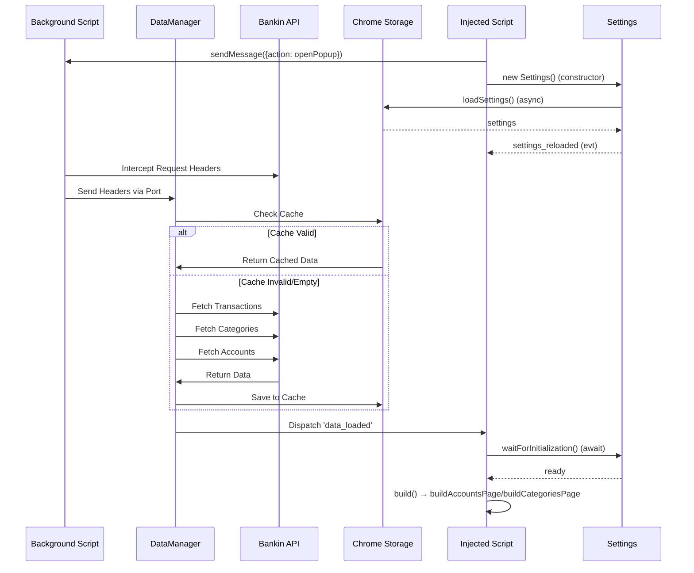
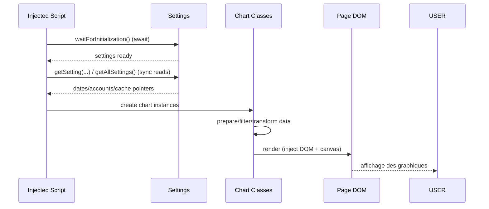

# Architecture de Pecunio

## Vue d'ensemble

Pecunio est une extension Chrome qui enrichit l'interface de Bankin avec des visualisations de données financières personnalisées. L'extension intercepte les requêtes API de Bankin, récupère les données de transactions, catégories et comptes, puis les transforme en graphiques interactifs.

## Architecture générale

```mermaid
graph TB
    subgraph "Extension Chrome"
        BG[Background Script<br/>bg.js]
        POPUP[Popup<br/>popup.html/js]
        INJECTED[Content Script<br/>injected.js]
    end
    
    subgraph "Core"
        CONFIG[Config]
        EVT[Evt<br/>Event Manager]
        SETTINGS[Settings<br/>Storage Manager]
        DATAMGR[DataManager]
    end
    
    subgraph "Models"
        TRANS[Transaction]
        ACCOUNT[Account]
        CATEGORY[Category]
    end
    
    subgraph "Services"
        MERGER[DataMerger]
        REPORT_STORAGE[ReportStorage]
    end
    
    subgraph "Charts"
        BASE[BaseChartData]
        LINE[LineBarChart]
        BUDGET[BudgetChart]
        SANKEY[SankeyChart]
        EXPENSE_TYPE[ExpenseTypeChart]
    end
    
    subgraph "Report"
        REPORT_HTML[report.html/js]
        REPORT_FILTERS[ReportFilters]
        REPORT_BUILDER[ReportChartDataBuilder]
        PDF_EXPORTER[PdfExporter]
    end
    
    subgraph "UI"
        STYLES[InjectedStyles]
        LOADING[LoadingScreen]
        HIDER[AmountHider]
        REVIEW[ReviewPrompt]
    end
    
    subgraph "External"
        BANKIN_API[Bankin API]
        CHROME_STORAGE[Chrome Storage]
    end
    
    BG -->|Intercept Headers| BANKIN_API
    BG -->|Send Headers| DATAMGR
    DATAMGR -->|Fetch Data| BANKIN_API
    DATAMGR -->|Cache| CHROME_STORAGE
    SETTINGS -->|Read/Write| CHROME_STORAGE
    DATAMGR -->|Transform| TRANS
    DATAMGR -->|Transform| ACCOUNT
    DATAMGR -->|Transform| CATEGORY
    MERGER -->|Uses| TRANS
    MERGER -->|Uses| ACCOUNT
    MERGER -->|Uses| CATEGORY
    INJECTED -->|Uses| DATAMGR
    INJECTED -->|Uses| SETTINGS
    INJECTED -->|Uses| REVIEW
    INJECTED -->|Creates| LINE
    INJECTED -->|Creates| BUDGET
    INJECTED -->|Creates| SANKEY
    INJECTED -->|Creates| EXPENSE_TYPE
    LINE -->|Extends| BASE
    BUDGET -->|Extends| BASE
    SANKEY -->|Extends| BASE
    EXPENSE_TYPE -->|Extends| BASE
    POPUP -->|Uses| SETTINGS
    POPUP -->|Uses| MERGER
    POPUP -->|Uses| REPORT_STORAGE
    REPORT_HTML -->|Uses| REPORT_STORAGE
    REPORT_HTML -->|Uses| REPORT_FILTERS
    REPORT_HTML -->|Uses| REPORT_BUILDER
    REPORT_HTML -->|Uses| PDF_EXPORTER
    EVT -->|Coordinates| INJECTED
    EVT -->|Coordinates| POPUP
    CONFIG -->|Provides Constants| DATAMGR
    CONFIG -->|Provides Constants| BASE
```

## Flux de données

### 1. Initialisation et récupération des données

### 2. Affichage des graphiques

## Structure des modules

### Core (`js/core/`)

#### Config.js
Centralise toutes les constantes de configuration :
- URLs et endpoints API
- IDs de catégories spéciales
- Sélecteurs CSS
- Clés de stockage
- Configuration des graphiques

#### Evt.js
Gestionnaire d'événements centralisé utilisant les CustomEvents du DOM :
- Écoute et dispatch d'événements
- Gestion des listeners multiples
- Mode debug

#### Settings.js
Gestionnaire de persistance des paramètres :
- Interface avec `chrome.storage.local`
- Validation des données
- Gestion de l'initialisation asynchrone

#### DataManager.js
Gestionnaire centralisé des données :
- Récupération depuis l'API Bankin
- Gestion du cache
- Transformation des données brutes
- Filtrage des transactions

### Models (`js/models/`)

#### Transaction.js
Modèle représentant une transaction bancaire :
- Validation des données
- Calcul de dates ajustées
- Méthodes utilitaires (isExpense, isIncome, etc.)

#### Account.js
Modèle représentant un compte bancaire :
- Validation simple
- Méthodes d'affichage

#### Category.js
Modèle représentant une catégorie :
- Support des catégories parent/enfant
- Validation

### Services (`js/services/`)

#### DataMerger.js
Service de fusion et transformation des données :
- Fusion transactions + catégories + comptes
- Filtrage par date et compte
- Export CSV
- Calcul de statistiques

#### ReportStorage.js
Service de stockage des données du rapport PDF :
- Sauvegarde/lecture des données fusionnées, stats et paramètres dans `chrome.storage.local`
- Utilisé par la popup (écriture) et par `report.html` (lecture)

### Report (`js/report/`)

Module rapport PDF (page `report.html`), alimenté par la popup via ReportStorage.

#### ReportFilters.js
- Filtrage des données (exclusion des catégories d’exception, cohérent avec Config)
- Calcul des statistiques (revenus, dépenses, totaux)
- Filtres pour le graphique Revenus vs Dépenses (épargne, remboursements)

#### ReportChartDataBuilder.js
- Construction des données pour les graphiques du rapport (catégories, évolution, Sankey, polar, type de dépenses)

#### PdfExporter.js
- Export du contenu du rapport (HTML + canvas Chart.js) en PDF via html2pdf

### Charts (`js/charts/`)

#### BaseChartData.js
Classe de base pour tous les graphiques :
- Filtrage commun des transactions
- Gestion des catégories
- Parsing des couleurs CSS
- Méthodes utilitaires

#### LineBarChart.js
Graphique linéaire/barres empilées :
- Affichage temporel des dépenses
- Toggle entre ligne et barres
- Cumul par catégorie

#### BudgetChart.js
Graphique de comparaison budgétaire :
- Comparaison médiane/moyenne
- Sélection de périodes
- Gestion de la visibilité des catégories

#### SankeyChart.js
Diagramme de Sankey pour flux financiers :
- Visualisation Budget → Dépenses
- Organisation par catégories

#### ExpenseTypeChart.js
Répartition des dépenses par type (Essentiel, Plaisir, Épargne, Autre) :
- Utilisé sur la page catégories Bankin
- Données alignées avec les catégories Bankin

### UI (`js/ui/`)

#### InjectedStyles.js
Styles CSS injectés dans la page Bankin :
- Design cohérent
- Classes utilitaires
- Responsive

#### LoadingScreen.js
Écran de chargement pendant le traitement

#### AmountHider.js
Masquage des montants sensibles :
- Toggle blur/unblur
- Persistance de l'état

#### ReviewPrompt.js
Modale d'invitation à laisser un avis sur le Chrome Web Store :
- Affichage conditionnel (nombre de builds, état « plus tard » / « jamais »)
- Stockage dans `chrome.storage.local` (compteur, état, date de report)
- Option debug via `Config.REVIEW.DEBUG` pour forcer l'affichage
- Détails : voir [services/ReviewPrompt.md](services/ReviewPrompt.md)

## Améliorations réalisées et pistes

### 1. Unification des services ✅
`DataManager` est le seul service de récupération des données (API Bankin, cache, validation). Aucun `BankinDataService` résiduel.

### 2. Duplication de code

**Problème** : `parseColorCSS` est dupliqué dans plusieurs endroits.

**Solution** :
- Utiliser uniquement `ColorParser.parseColorCSS()`
- Supprimer les duplications

### 3. Gestion d’erreurs et validation ✅
DataManager utilise des erreurs typées (`AuthenticationError`, `ValidationError`, `APIError`) et des validators (`DataValidators`). Le cache est vidé correctement via `removeSetting` lors d’un refresh.

### 4. Dépendances globales

**Problème** : Les charts dépendent directement de `settingClass` global.

**Solution** :
- Injecter `Settings` via le constructeur
- Utiliser l'injection de dépendances

### 5. Gestion d’erreurs (affichage)
Standardiser l’affichage des erreurs côté UI (messages utilisateur cohérents).

## Schémas détaillés par service

Voir les fichiers dans `docs/services/` pour les schémas détaillés de chaque service.
