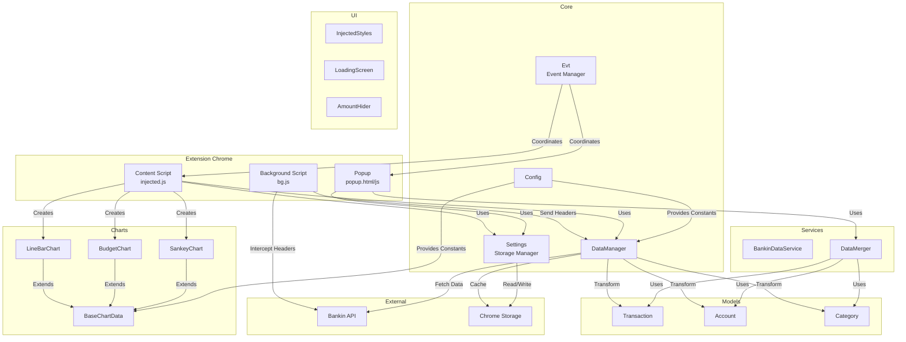
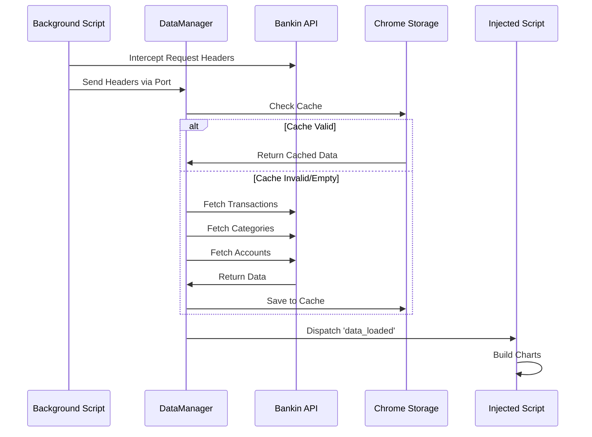
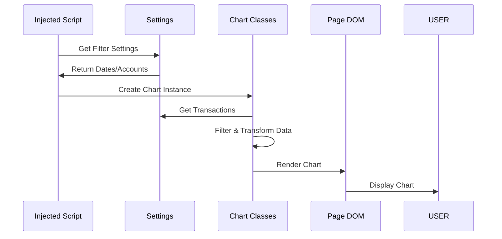

# Architecture de Pecunio

## Vue d'ensemble

Pecunio est une extension Chrome qui enrichit l'interface de Bankin avec des visualisations de données financières personnalisées. L'extension intercepte les requêtes API de Bankin, récupère les données de transactions, catégories et comptes, puis les transforme en graphiques interactifs.

## Architecture générale

## Flux de données

### 1. Initialisation et récupération des données

### 2. Affichage des graphiques

## Structure des modules

### Core (`js/core/`)

#### Config.js
Centralise toutes les constantes de configuration :
- URLs et endpoints API
- IDs de catégories spéciales
- Sélecteurs CSS
- Clés de stockage
- Configuration des graphiques

#### Evt.js
Gestionnaire d'événements centralisé utilisant les CustomEvents du DOM :
- Écoute et dispatch d'événements
- Gestion des listeners multiples
- Mode debug

#### Settings.js
Gestionnaire de persistance des paramètres :
- Interface avec `chrome.storage.local`
- Validation des données
- Gestion de l'initialisation asynchrone

#### DataManager.js
Gestionnaire centralisé des données :
- Récupération depuis l'API Bankin
- Gestion du cache
- Transformation des données brutes
- Filtrage des transactions

### Models (`js/models/`)

#### Transaction.js
Modèle représentant une transaction bancaire :
- Validation des données
- Calcul de dates ajustées
- Méthodes utilitaires (isExpense, isIncome, etc.)

#### Account.js
Modèle représentant un compte bancaire :
- Validation simple
- Méthodes d'affichage

#### Category.js
Modèle représentant une catégorie :
- Support des catégories parent/enfant
- Validation

### Services (`js/services/`)

#### BankinDataService.js ⚠️ (À déprécier)
Ancien service de récupération de données. **Doit être remplacé par DataManager**.

#### DataMerger.js
Service de fusion et transformation des données :
- Fusion transactions + catégories + comptes
- Filtrage par date et compte
- Export CSV
- Calcul de statistiques

### Charts (`js/charts/`)

#### BaseChartData.js
Classe de base pour tous les graphiques :
- Filtrage commun des transactions
- Gestion des catégories
- Parsing des couleurs CSS
- Méthodes utilitaires

#### LineBarChart.js
Graphique linéaire/barres empilées :
- Affichage temporel des dépenses
- Toggle entre ligne et barres
- Cumul par catégorie

#### BudgetChart.js
Graphique de comparaison budgétaire :
- Comparaison médiane/moyenne
- Sélection de périodes
- Gestion de la visibilité des catégories

#### SankeyChart.js
Diagramme de Sankey pour flux financiers :
- Visualisation Budget → Dépenses
- Organisation par catégories

### UI (`js/ui/`)

#### InjectedStyles.js
Styles CSS injectés dans la page Bankin :
- Design cohérent
- Classes utilitaires
- Responsive

#### LoadingScreen.js
Écran de chargement pendant le traitement

#### AmountHider.js
Masquage des montants sensibles :
- Toggle blur/unblur
- Persistance de l'état

## Problèmes identifiés et solutions

### 1. Duplication de services

**Problème** : `BankinDataService` et `DataManager` font la même chose.

**Solution** : 
- Déprécier `BankinDataService`
- Utiliser uniquement `DataManager`
- Mettre à jour `injected.js` pour utiliser `DataManager`

### 2. Duplication de code

**Problème** : `parseColorCSS` est dupliqué dans plusieurs endroits.

**Solution** :
- Utiliser uniquement `ColorParser.parseColorCSS()`
- Supprimer les duplications

### 3. Dépendances globales

**Problème** : Les charts dépendent directement de `settingClass` global.

**Solution** :
- Injecter `Settings` via le constructeur
- Utiliser l'injection de dépendances

### 4. Gestion d'erreurs inconsistante

**Problème** : Certaines erreurs sont silencieuses, d'autres loggées.

**Solution** :
- Standardiser la gestion d'erreurs
- Ajouter des validations partout
- Utiliser des erreurs typées

## Schémas détaillés par service

Voir les fichiers dans `docs/services/` pour les schémas détaillés de chaque service.
