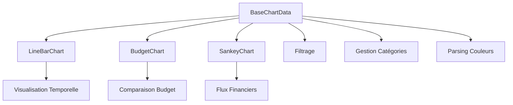
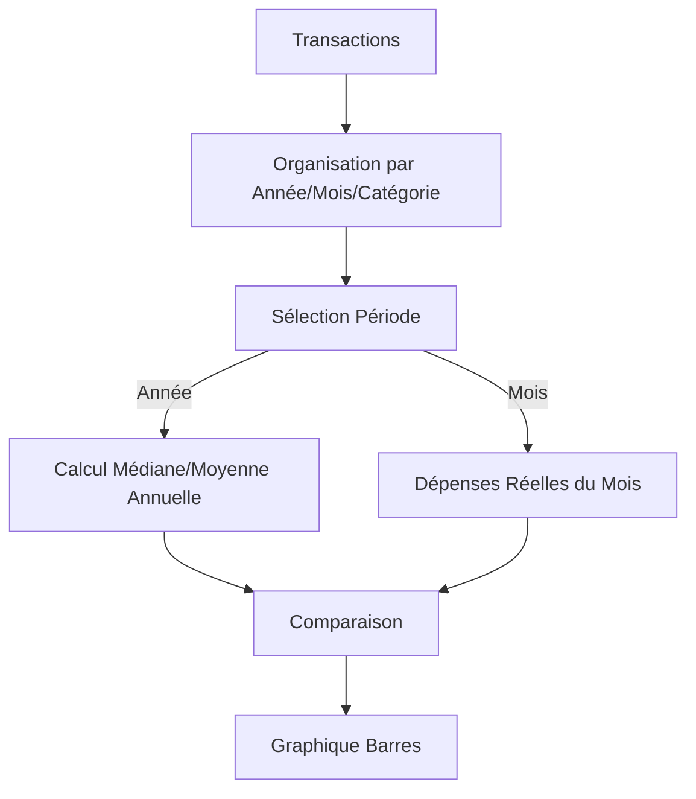
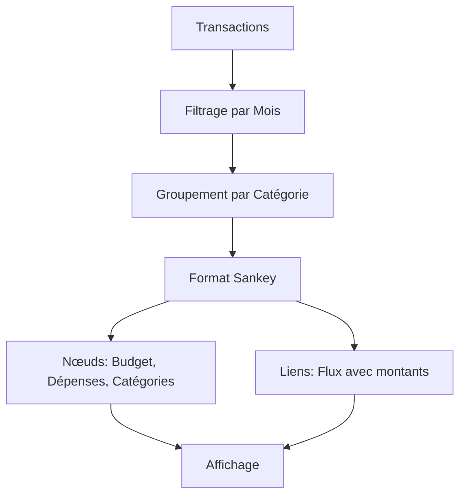

# Charts - Système de graphiques

## Architecture

Tous les graphiques héritent de `BaseChartData` qui fournit :
- Filtrage commun des transactions
- Gestion des catégories
- Parsing des couleurs
- Méthodes utilitaires



## BaseChartData

### Responsabilités

1. **Filtrage des données** :
   - Par date (startDate, endDate)
   - Par compte (accountsSelected)
   - Par mois/année spécifiques
   - Exclusion des catégories d'exception

2. **Gestion des catégories** :
   - Lookup rapide par ID
   - Organisation parent/enfant
   - Filtrage des catégories valides

3. **Utilitaires** :
   - Parsing des couleurs CSS
   - Formatage de dates
   - Calculs statistiques (moyenne, médiane)

### Méthodes principales

```javascript
class BaseChartData {
    applySettingOnData(options): Array<Transaction>
    applySettingOnDataByMonth(month, year): Array<Transaction>
    mergeTransactionByCategory(transactions, categories): Map
    parseColorCSS(cssClass): string
    getCategoryNameById(categoryId): string
    isExceptionCategory(categoryId): boolean
}
```

## LineBarChart

### Responsabilités

- Affichage temporel des dépenses par catégorie
- Toggle entre graphique linéaire et barres empilées
- Cumul mensuel des transactions
- Gestion de la visibilité des catégories

### Flux de données


## BudgetChart

### Responsabilités

- Comparaison de budgets entre périodes
- Calcul de médiane/moyenne mensuelle
- Comparaison année complète vs mois spécifique
- Gestion de la visibilité des catégories via storage

### Flux de données



### Structure de données organisées

```javascript
{
    [year]: {
        [month]: {
            [categoryName]: [amount1, amount2, ...]
        }
    }
}
```

## SankeyChart

### Responsabilités

- Visualisation des flux financiers
- Organisation Budget → Catégories → Sous-catégories
- Calcul des totaux et restes

### Flux de données



## Améliorations proposées

1. **Interface commune** : Définir une interface `IChart` pour tous les graphiques
2. **Factory pattern** : Créer les graphiques via une factory
3. **Configuration centralisée** : Options Chart.js dans Config
4. **Tests unitaires** : Tester la transformation des données
5. **Performance** : Lazy loading des données volumineuses
6. **Accessibilité** : Ajouter des labels ARIA et support clavier
