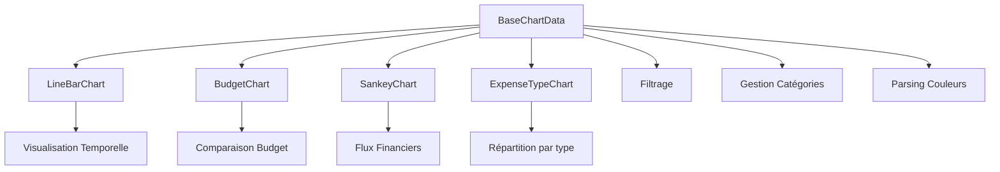
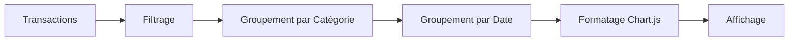
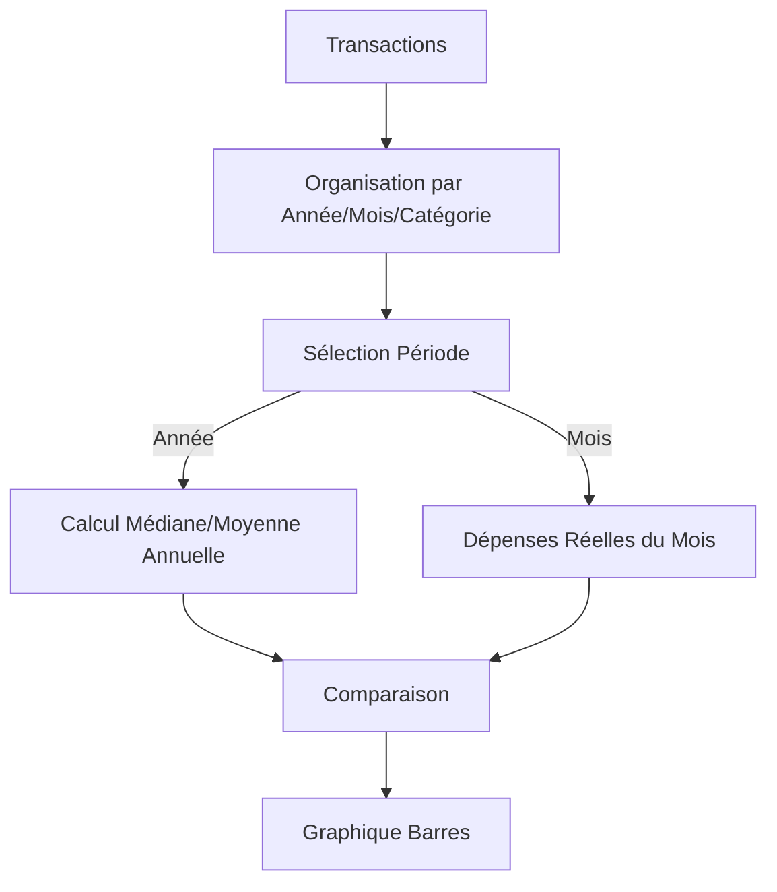
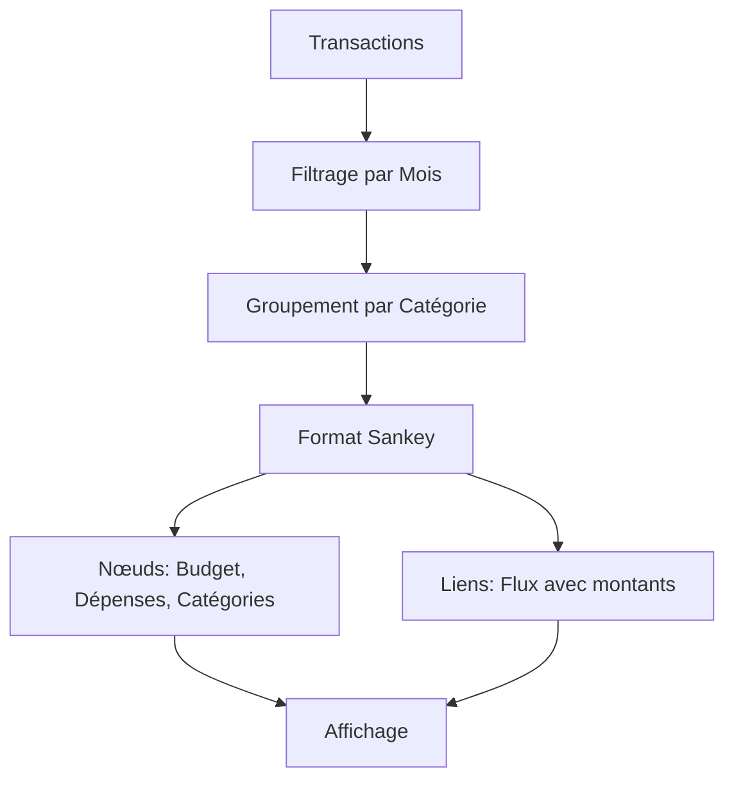

# Charts - Système de graphiques

## Architecture

Tous les graphiques héritent de `BaseChartData` qui fournit :
- Filtrage commun des transactions
- Gestion des catégories
- Parsing des couleurs
- Méthodes utilitaires



## BaseChartData

### Responsabilités

1. **Filtrage des données** :
   - Par date (startDate, endDate)
   - Par compte (accountsSelected)
   - Par mois/année spécifiques
   - Exclusion des catégories d'exception

2. **Gestion des catégories** :
   - Lookup rapide par ID
   - Organisation parent/enfant
   - Filtrage des catégories valides

3. **Utilitaires** :
   - Parsing des couleurs CSS
   - Formatage de dates
   - Calculs statistiques (moyenne, médiane)

### Méthodes principales

```javascript
class BaseChartData {
    applySettingOnData(options): Array<Transaction>
    applySettingOnDataByMonth(month, year): Array<Transaction>
    mergeTransactionByCategory(transactions, categories): Map
    parseColorCSS(cssClass): string
    getCategoryNameById(categoryId): string
    isExceptionCategory(categoryId): boolean
}
```

## LineBarChart

### Responsabilités

- Affichage temporel des dépenses par catégorie
- Toggle entre graphique linéaire et barres empilées
- Cumul mensuel des transactions
- Gestion de la visibilité des catégories

### Flux de données



## BudgetChart

### Responsabilités

- Comparaison de budgets entre périodes
- Calcul de médiane/moyenne mensuelle
- Comparaison année complète vs mois spécifique
- Gestion de la visibilité des catégories via storage

### Flux de données



### Structure de données organisées

```javascript
{
    [year]: {
        [month]: {
            [categoryName]: [amount1, amount2, ...]
        }
    }
}
```

## SankeyChart

### Responsabilités

- Visualisation des flux financiers
- Organisation Budget → Catégories → Sous-catégories
- Calcul des totaux et restes

### Flux de données



## ExpenseTypeChart

### Responsabilités

- Répartition des dépenses par type (Essentiel, Plaisir, Épargne, Autre)
- Utilisé sur la page catégories Bankin
- Données alignées avec les catégories et types de dépenses Bankin

## Exemples d'utilisation

### Exemple 1 : Créer un LineBarChart

```javascript
const settingClass = new Settings();
await settingClass.waitForInitialization();

const transactions = settingClass.getSetting('cache_data_transactions');
const categories = settingClass.getSetting('cache_data_categories');
const accountsSelected = settingClass.getSetting('accountsSelected');
const settings = settingClass.getAllSettings();

// Créer le chart avec injection de Settings
const chartData = new LineBarChart(
    transactions,
    categories,
    accountsSelected,
    settings,
    settingClass // Injection de Settings
);

// Préparer les données
const preparedData = await chartData.prepareData();

// Obtenir la configuration Chart.js
const chartJsConfig = await chartData.getChartJsConfig();
chartJsConfig.data = preparedData;

// Créer le graphique
const canvas = document.getElementById('myChart');
const ctx = canvas.getContext('2d');
new Chart(ctx, chartJsConfig);
```

### Exemple 2 : Créer un BudgetChart

```javascript
const settingClass = new Settings();
await settingClass.waitForInitialization();

const transactions = settingClass.getSetting('cache_data_transactions');
const categories = settingClass.getSetting('cache_data_categories');
const accountsSelected = settingClass.getSetting('accountsSelected');
const settings = settingClass.getAllSettings();

// Créer le chart
const budgetChart = new BudgetChart(
    transactions,
    categories,
    accountsSelected,
    settings,
    settingClass // Injection de Settings
);

// Créer l'UI (gère automatiquement le graphique)
budgetChart.createUI('budgetChartContainer');
```

### Exemple 3 : Créer un SankeyChart

```javascript
const settingClass = new Settings();
await settingClass.waitForInitialization();

const transactions = settingClass.getSetting('cache_data_transactions');
const categories = settingClass.getSetting('cache_data_categories');

// Paramètres : [mois, année]
const params = ['janvier', '2024'];

// Créer le chart
const sankeyChart = new SankeyChart(
    transactions,
    categories,
    params,
    settingClass // Injection de Settings
);

// Préparer les données
const sankeyData = await sankeyChart.prepareData();

// Créer le graphique Chart.js directement
const canvas = document.getElementById('sankeyChart');
const ctx = canvas.getContext('2d');
new Chart(ctx, {
    type: 'sankey',
    data: {
        datasets: [{
            label: 'Flux financiers',
            data: sankeyData,
            colorFrom: (c) => ColorParser.parseColorCSS("categoryColor_" + c.dataset.data[c.dataIndex].id),
            colorTo: (c) => ColorParser.parseColorCSS("categoryColor_" + c.dataset.data[c.dataIndex].id),
        }]
    },
    options: {
        responsive: true,
        maintainAspectRatio: false
    }
});
```

### Exemple 4 : Utiliser BaseChartData pour filtrer

```javascript
const baseChart = new BaseChartData(
    transactions,
    categories,
    accountsSelected,
    settings,
    settingClass
);

// Filtrer les transactions
const filtered = baseChart.applySettingOnData({
    startDate: '2024-01-01',
    endDate: '2024-12-31',
    accountsSelected: [123, 456]
});

// Filtrer par mois spécifique
const januaryTransactions = baseChart.applySettingOnDataByMonth('january', 2024);

// Fusionner par catégorie
const byCategory = baseChart.mergeTransactionByCategory(
    filtered,
    categories
);

// Vérifier si une catégorie est une exception
if (baseChart.isExceptionCategory(326)) {
    console.log('Catégorie d\'exception');
}
```

### Exemple 5 : Utiliser les méthodes utilitaires

```javascript
const baseChart = new BaseChartData(transactions, categories);

// Obtenir le nom d'une catégorie
const categoryName = baseChart.getCategoryNameById(123);
console.log('Catégorie:', categoryName);

// Obtenir toutes les catégories valides (non-exception)
const validCategories = baseChart.getValidCategories();

// Formater une date
const date = new Date();
const formatted = baseChart.formatDateToYearMonth(date);
console.log('Date formatée:', formatted); // "2024-01"

// Obtenir le nom court d'un mois
const monthName = baseChart.getMonthName(1);
console.log('Mois:', monthName); // "Jan"

// Calculer la médiane
const values = [1, 2, 3, 4, 5];
const median = BaseChartData.calculateMedian(values);
console.log('Médiane:', median); // 3

// Calculer la moyenne
const average = BaseChartData.calculateAverage(values);
console.log('Moyenne:', average); // 3
```

## Interface IChart

Tous les charts implémentent l'interface `IChart` :

```javascript
interface IChart {
    // Préparer les données pour le graphique
    async prepareData(...args): Promise<Object>;
    
    // Pour les charts Chart.js : retourner la configuration
    async getChartJsConfig(): Promise<Object>; // Optionnel
}
```

## Améliorations implémentées

1. ✅ **Interface commune** : Documentation de l'interface `IChart`
2. ✅ **Injection de dépendances** : `Settings` injecté via le constructeur
3. ✅ **Suppression des dépendances globales** : Plus de dépendance à `settingClass` global
4. ✅ **Standardisation** : Méthodes `prepareData()` et `getChartJsConfig()` standardisées
