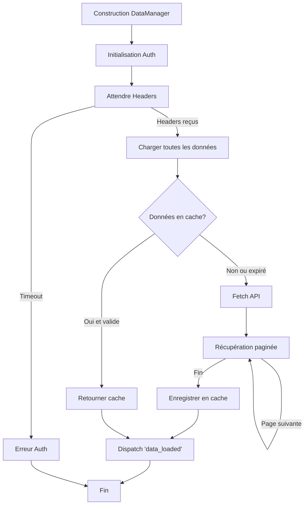

# DataManager - Service de gestion des données

## Responsabilités

Le `DataManager` est responsable de :
1. Récupération des headers d'authentification depuis le background script
2. Chargement des données depuis l'API Bankin (transactions, catégories, comptes)
3. Gestion du cache avec durée de validité
4. Transformation des données brutes en modèles
5. Filtrage des transactions selon différents critères

## Schéma de flux



## Interface publique

```javascript
class DataManager {
    // Méthodes principales
    async waitForInitialization(): Promise<void>
    getCachedData(): Object
    async refreshData(): Promise<Object>
    filterTransactions(transactions, options): Array<Transaction>
    organizeTransactionsByCategory(transactions, categories): Map
    createCategoryLookup(categories): Map
}
```

## Dépendances

- `Config` : Pour les constantes (URLs, endpoints, durée de cache)
- `Settings` : Pour le stockage du cache
- `Evt` : Pour dispatcher les événements

## Événements émis

- `data_loaded` : Quand toutes les données sont chargées
- `fresh_data_loaded` : Quand de nouvelles données sont récupérées depuis l'API
- `cache_data_{type}_loaded` : Quand des données sont chargées depuis le cache

## Améliorations proposées

1. **Gestion d'erreurs robuste** : Retry automatique en cas d'échec
2. **Validation des données** : Vérifier la structure des données reçues
3. **Métriques** : Ajouter des logs de performance
4. **Cache intelligent** : Invalidation sélective par type de données
