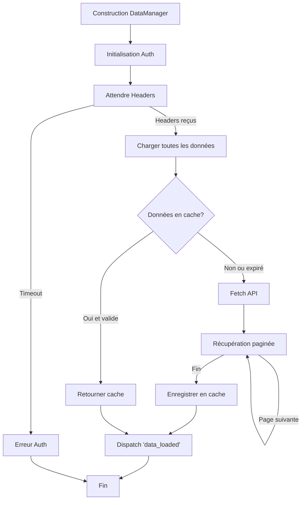

# DataManager - Service de gestion des données

## Responsabilités

Le `DataManager` est responsable de :
1. Récupération des headers d'authentification depuis le background script
2. Chargement des données depuis l'API Bankin (transactions, catégories, comptes)
3. Gestion du cache avec durée de validité
4. Transformation des données brutes en modèles
5. Filtrage des transactions selon différents critères

## Schéma de flux



## Interface publique

```javascript
class DataManager {
    // Méthodes principales
    async waitForInitialization(): Promise<void>
    getCachedData(): Object
    async refreshData(): Promise<Object>
    filterTransactions(transactions, options): Array<Transaction>
    organizeTransactionsByCategory(transactions, categories): Map
    createCategoryLookup(categories): Map
}
```

## Dépendances

- `Config` : Pour les constantes (URLs, endpoints, durée de cache)
- `Settings` : Pour le stockage du cache
- `Evt` : Pour dispatcher les événements

## Événements émis

- `data_loaded` : Quand toutes les données sont chargées
- `fresh_data_loaded` : Quand de nouvelles données sont récupérées depuis l'API
- `cache_data_{type}_loaded` : Quand des données sont chargées depuis le cache

## Exemples d'utilisation

### Exemple 1 : Initialisation et chargement des données

```javascript
const evt = new Evt();
const dataManager = new DataManager();

// Attendre que les données soient chargées
evt.listen('data_loaded', () => {
    const data = dataManager.getCachedData();
    console.log('Données chargées:', data);
    
    // Utiliser les données
    const transactions = data.transactions;
    const categories = data.categories;
    const accounts = data.accounts;
});

// Ou attendre explicitement
await dataManager.waitForInitialization();
const data = dataManager.getCachedData();
```

### Exemple 2 : Forcer le rechargement des données

```javascript
try {
    await dataManager.refreshData();
    console.log('Données rechargées avec succès');
} catch (error) {
    if (error instanceof AuthenticationError) {
        console.error('Erreur d\'authentification:', error.message);
    } else if (error instanceof APIError) {
        console.error('Erreur API:', error.statusCode, error.url);
    } else {
        console.error('Erreur inconnue:', error);
    }
}
```

### Exemple 3 : Filtrer les transactions

```javascript
const data = dataManager.getCachedData();
const allTransactions = data.transactions;

// Filtrer par date
const filtered = dataManager.filterTransactions(allTransactions, {
    startDate: '2024-01-01',
    endDate: '2024-12-31',
    accountsSelected: [123, 456], // IDs des comptes
    excludeCategories: Config.CATEGORIES.EXCEPTION_IDS
});

console.log(`${filtered.length} transactions après filtrage`);
```

### Exemple 4 : Organiser les transactions par catégorie

```javascript
const data = dataManager.getCachedData();
const transactions = data.transactions;
const categories = data.categories;

// Organiser par catégorie
const organized = dataManager.organizeTransactionsByCategory(
    transactions,
    categories
);

// Parcourir les catégories
organized.forEach((transactions, categoryId) => {
    console.log(`Catégorie ${categoryId}: ${transactions.length} transactions`);
});
```

### Exemple 5 : Créer un lookup de catégories

```javascript
const data = dataManager.getCachedData();
const categories = data.categories;

// Créer un lookup pour recherche rapide
const lookup = dataManager.createCategoryLookup(categories);

// Utiliser le lookup
const categoryName = lookup.get(123);
console.log('Nom de la catégorie 123:', categoryName);
```

### Exemple 6 : Gestion des erreurs typées

```javascript
try {
    await dataManager.refreshData();
} catch (error) {
    if (error instanceof AuthenticationError) {
        // Erreur d'authentification
        console.error('Code:', error.code);
        console.error('Détails:', error.details);
        // Afficher un message à l'utilisateur
        alert('Veuillez rafraîchir la page Bankin pour vous authentifier.');
    } else if (error instanceof ValidationError) {
        // Erreur de validation
        console.error('Type de données invalides:', error.dataType);
        console.error('Données invalides:', error.invalidData);
    } else if (error instanceof APIError) {
        // Erreur API
        console.error('Status:', error.statusCode);
        console.error('URL:', error.url);
    } else {
        // Autre erreur
        console.error('Erreur inconnue:', error);
    }
}
```

## Améliorations implémentées

1. ✅ **Gestion d'erreurs robuste** : Retry automatique avec backoff exponentiel
2. ✅ **Validation des données** : Validation complète avec messages d'erreur clairs
3. ✅ **Erreurs typées** : `AuthenticationError`, `ValidationError`, `APIError`
4. ✅ **Logging détaillé** : Logs des données invalides pour le debug
