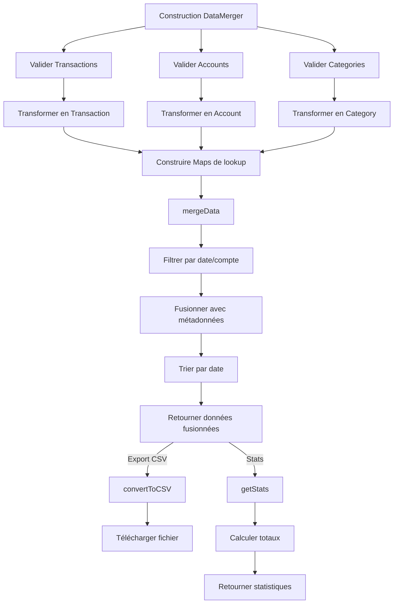

# DataMerger - Service de fusion et transformation

## Responsabilités

Le `DataMerger` est responsable de :
1. Validation et transformation des données brutes en modèles
2. Fusion des transactions avec leurs métadonnées (catégories, comptes)
3. Filtrage selon les critères de l'utilisateur
4. Export au format CSV
5. Calcul de statistiques

## Schéma de flux



## Interface publique

```javascript
class DataMerger {
    constructor(
        transactions: Array,
        categories: Array,
        accounts: Array,
        startDate?: string,
        endDate?: string,
        accountsSelected?: Array<number>
    )
    
    // Méthodes principales
    mergeData(): Array<Object>
    convertToCSV(data: Array<Object>): string
    exportToCSV(): void
    getStats(): Object
}
```

## Format de données fusionnées

```javascript
{
    transactionId: number,
    date: string, // YYYY-MM-DD
    amount: number,
    description: string,
    accountId: number,
    accountName: string,
    categoryId: number,
    categoryName: string,
    parentCategoryId: number | null,
    parentCategoryName: string,
    expenseType: string | null
}
```

## Dépendances

- `Transaction` : Modèle de transaction
- `Account` : Modèle de compte
- `Category` : Modèle de catégorie

## Améliorations proposées

1. **Validation stricte** : Rejeter les données invalides avec des erreurs claires
2. **Performance** : Optimiser les lookups avec des Maps
3. **Export multiple formats** : JSON, Excel en plus du CSV
4. **Filtres avancés** : Par catégorie, par type de transaction, etc.
