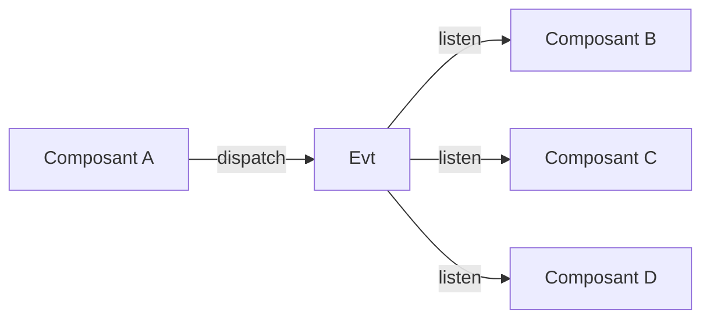

# Events (Evt) - Système d'événements

## Vue d'ensemble

Le système d'événements `Evt` permet la communication entre les différents composants de l'extension Pecunio. Il utilise les événements DOM personnalisés pour permettre une communication découplée entre les modules.

## Architecture



## Événements disponibles

### `data_loaded`
**Déclenché par :** `DataManager`  
**Quand :** Les données (transactions, catégories, comptes) ont été chargées avec succès  
**Utilisé par :** `injected.js` pour construire les graphiques

```javascript
evt.listen('data_loaded', async () => {
    await build();
});
```

### `settings_reloaded`
**Déclenché par :** `Settings`  
**Quand :** Les paramètres ont été rechargés depuis le stockage  
**Utilisé par :** `injected.js` pour mettre à jour les settings

```javascript
evt.listen("settings_reloaded", async () => {
    await settingClass.waitForInitialization();
    setting = settingClass.getAllSettings();
});
```

### `url_change`
**Déclenché par :** `injected.js`  
**Quand :** L'URL de la page Bankin change  
**Utilisé par :** `injected.js` pour reconstruire les graphiques selon la nouvelle page

```javascript
evt.listen('url_change', async () => {
    try {
        await build();
    } catch (error) {
        console.error("[InjectedJS] Error during url_change event:", error);
    }
});
```

### `cache_data_<type>_loaded`
**Déclenché par :** `DataManager`  
**Quand :** Des données en cache sont chargées (transactions, categories, accounts)  
**Type peut être :** `transactions`, `categories`, `accounts`

```javascript
evt.listen('cache_data_transactions_loaded', () => {
    console.log('Transactions chargées depuis le cache');
});
```

### `fresh_data_loaded`
**Déclenché par :** `DataManager`  
**Quand :** Des données fraîches sont récupérées depuis l'API Bankin (pendant la pagination)

```javascript
evt.listen('fresh_data_loaded', () => {
    console.log('Nouvelles données récupérées depuis l\'API');
});
```

### `build called`
**Déclenché par :** `injected.js`  
**Quand :** La fonction `build()` est appelée pour construire les graphiques

## Interface publique

### Méthodes principales

#### `listen(eventName, callback, once, useChromeMessaging)`
Écoute un événement et exécute un callback quand il est déclenché.

**Paramètres :**
- `eventName` (string) : Nom de l'événement
- `callback` (Function) : Fonction à exécuter
- `once` (boolean, optionnel) : Si true, l'écouteur ne s'exécute qu'une fois
- `useChromeMessaging` (boolean, optionnel) : Si true, utilise chrome.runtime.sendMessage (non implémenté actuellement)

**Exemple :**
```javascript
const evt = new Evt();

// Écouter un événement
evt.listen('data_loaded', () => {
    console.log('Données chargées !');
});

// Écouter une seule fois
evt.listen('settings_reloaded', () => {
    console.log('Settings rechargés');
}, true);
```

#### `dispatch(eventName, useChromeMessaging, data)`
Déclenche un événement.

**Paramètres :**
- `eventName` (string) : Nom de l'événement
- `useChromeMessaging` (boolean, optionnel) : Si true, utilise chrome.runtime.sendMessage
- `data` (any, optionnel) : Données à passer avec l'événement

**Exemple :**
```javascript
// Déclencher un événement simple
evt.dispatch('data_loaded');

// Déclencher un événement avec des données
evt.dispatch('custom_event', false, { userId: 123, action: 'click' });
```

#### `removeListener(eventName, callback)`
Supprime un écouteur spécifique.

**Exemple :**
```javascript
const myCallback = () => console.log('Event received');

evt.listen('data_loaded', myCallback);
// Plus tard...
evt.removeListener('data_loaded', myCallback);
```

#### `removeAllListeners(eventName)`
Supprime tous les écouteurs d'un événement.

**Exemple :**
```javascript
evt.removeAllListeners('data_loaded');
```

### Méthodes utilitaires

#### `hasListeners(eventName)`
Vérifie si un événement a des écouteurs.

```javascript
if (evt.hasListeners('data_loaded')) {
    console.log('Des écouteurs sont actifs');
}
```

#### `getListenerCount(eventName)`
Retourne le nombre d'écouteurs pour un événement.

```javascript
const count = evt.getListenerCount('data_loaded');
console.log(`${count} écouteurs actifs`);
```

#### `enableDebug()` / `disableDebug()`
Active/désactive le mode debug pour voir les logs d'événements.

```javascript
evt.enableDebug();
// Tous les événements seront loggés dans la console
```

#### `getStats()`
Retourne des statistiques sur les événements.

```javascript
const stats = evt.getStats();
console.log(stats);
// {
//     totalEvents: 5,
//     totalListeners: 8,
//     eventsWithListeners: 3
// }
```

#### `cleanup()`
Nettoie tous les écouteurs et événements dispatchés.

```javascript
evt.cleanup();
```

## Exemples d'utilisation

### Exemple 1 : Écouter le chargement des données

```javascript
const evt = new Evt();
const dataManager = new DataManager();

evt.listen('data_loaded', async () => {
    const data = dataManager.getCachedData();
    console.log('Transactions:', data.transactions.length);
    console.log('Catégories:', data.categories.length);
    console.log('Comptes:', data.accounts.length);
    
    // Construire les graphiques
    await buildCharts(data);
});
```

### Exemple 2 : Gérer les changements d'URL

```javascript
let currentUrl = location.href;

evt.listen('url_change', async () => {
    console.log('URL changée:', location.href);
    
    if (location.href.includes('/accounts')) {
        await buildAccountCharts();
    } else if (location.href.includes('/categories')) {
        await buildCategoryCharts();
    }
});

// Détecter les changements d'URL
setInterval(() => {
    if (location.href !== currentUrl) {
        currentUrl = location.href;
        evt.dispatch('url_change');
    }
}, 1000);
```

### Exemple 3 : Écouter plusieurs événements

```javascript
// Écouter plusieurs événements avec le même handler
const handleDataUpdate = () => {
    console.log('Données mises à jour');
    refreshUI();
};

evt.listen('data_loaded', handleDataUpdate);
evt.listen('fresh_data_loaded', handleDataUpdate);
evt.listen('cache_data_transactions_loaded', handleDataUpdate);
```

### Exemple 4 : Utiliser le mode debug

```javascript
const evt = new Evt();
evt.enableDebug();

// Tous les événements seront maintenant loggés
evt.listen('data_loaded', () => {
    // ...
});

evt.dispatch('data_loaded');
// Console: [Evt] Listener added for event: data_loaded
// Console: [Evt] Dispatching event: data_loaded
```

## Bonnes pratiques

1. **Nommer clairement les événements** : Utilisez des noms descriptifs comme `data_loaded` plutôt que `dl`
2. **Nettoyer les écouteurs** : Supprimez les écouteurs quand ils ne sont plus nécessaires pour éviter les fuites mémoire
3. **Utiliser `once` pour les événements uniques** : Si un événement ne doit être traité qu'une fois, utilisez le paramètre `once`
4. **Gérer les erreurs** : Toujours gérer les erreurs dans les callbacks d'événements
5. **Mode debug en développement** : Activez le mode debug pendant le développement pour tracer les événements

## Dépannage

### Un événement ne se déclenche pas
- Vérifiez que l'écouteur est ajouté avant le dispatch
- Utilisez `enableDebug()` pour voir les logs
- Vérifiez que l'événement est bien dispatché avec `getStats()`

### Fuites mémoire
- Utilisez `removeListener()` ou `removeAllListeners()` pour nettoyer
- Utilisez `cleanup()` pour tout nettoyer
- Vérifiez avec `getStats()` le nombre d'écouteurs actifs

### Événements dispatchés avant l'écoute
Le système gère automatiquement ce cas : si un événement a déjà été dispatché, le callback est exécuté immédiatement lors de l'ajout de l'écouteur.
