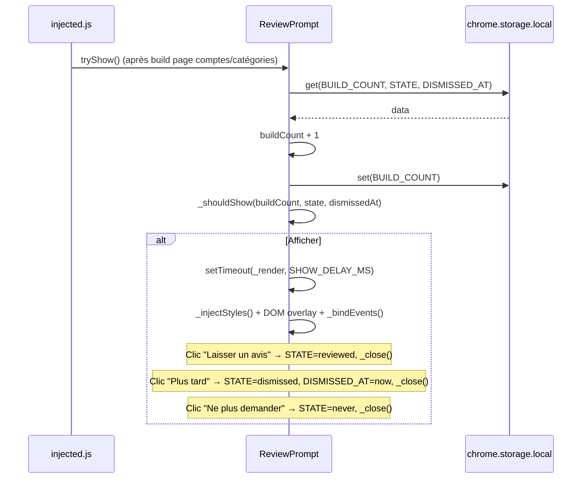

# ReviewPrompt - Invitation à laisser un avis

## Responsabilités

Le module `ReviewPrompt` (classe statique dans `js/ui/ReviewPrompt.js`) est responsable de :

1. **Affichage conditionnel** d’une modale invitant l’utilisateur à laisser un avis sur le Chrome Web Store
2. **Persistance** du nombre d’utilisations (« builds »), de l’état (jamais / plus tard / déjà noté) et de la date de report dans `chrome.storage.local`
3. **Respect de l’UX** : pas d’affichage avant un minimum d’utilisations, délai après « Plus tard », possibilité « Ne plus demander »

## Schéma de flux



## Interface publique

```javascript
class ReviewPrompt {
    // Constantes
    static STORE_URL: string
    static MIN_BUILDS_BEFORE_PROMPT: number
    static DISMISS_DELAY_DAYS: number
    static SHOW_DELAY_MS: number
    static STORAGE_KEYS: { BUILD_COUNT, STATE, DISMISSED_AT }
    static STATE: { NONE, DISMISSED, REVIEWED, NEVER }
    static DOM: { OVERLAY_ID, STYLES_ID, CTA_ID, LATER_ID, NEVER_ID, VISIBLE_CLASS, CLOSE_ANIMATION_MS }

    // API publique
    static async tryShow(): Promise<void>
}
```

Toutes les autres méthodes sont internes (`_shouldShow`, `_getStyles`, `_injectStyles`, `_render`, `_bindEvents`, `_dismiss`, `_close`, `_setStorage`, `_getStorageData`).

## Clés de stockage (chrome.storage.local)

| Clé | Description |
|-----|-------------|
| `review_build_count` | Nombre de fois que la page comptes ou catégories a été construite (incrémenté à chaque `tryShow`) |
| `review_state` | `'none'` \| `'dismissed'` \| `'reviewed'` \| `'never'` |
| `review_dismissed_at` | Timestamp (ms) du dernier clic « Plus tard » ; utilisé pour réafficher après `DISMISS_DELAY_DAYS` |

## Règles d’affichage

La modale est affichée si :

1. **Mode debug** : `Config.REVIEW.DEBUG === true` → toujours afficher (pour tests).
2. **État final** : si `state === 'reviewed'` ou `state === 'never'` → ne jamais afficher.
3. **Seuil d’utilisation** : si `buildCount < MIN_BUILDS_BEFORE_PROMPT` (5) → ne pas afficher.
4. **Report « Plus tard »** : si `state === 'dismissed'` et moins de `DISMISS_DELAY_DAYS` (14 jours) se sont écoulés depuis `review_dismissed_at` → ne pas afficher.

Sinon, après un délai de `SHOW_DELAY_MS` (2 s), la modale est rendue (styles injectés, overlay ajouté au DOM, événements liés).

## Configuration (Config.js)

```javascript
Config.REVIEW = {
    DEBUG: true  // true = forcer l’affichage à chaque chargement (à mettre à false en prod)
};
```

## Dépendances

- **Config** (global, optionnel) : utilisé uniquement pour `Config.REVIEW.DEBUG`.
- **chrome.storage.local** : lecture/écriture des clés listées ci-dessus.
- Appelé depuis **injected.js** après `buildAccountsPage()` ou `buildCategoriesPage()`.

## Conventions du module

- Classe **statique** : pas d’instance, tout est en méthodes/constantes statiques.
- IDs et classes DOM regroupés dans `ReviewPrompt.DOM` pour éviter les chaînes magiques.
- États nommés via `ReviewPrompt.STATE` pour cohérence avec le stockage.
