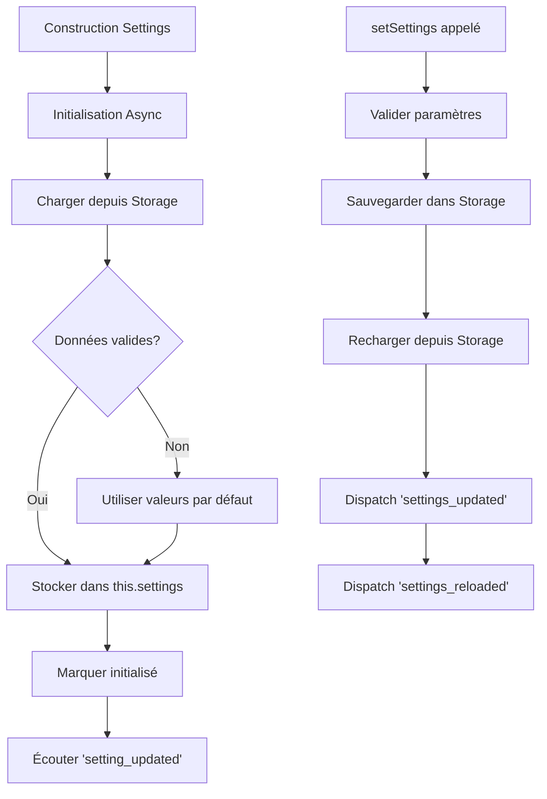

# Settings - Gestionnaire de paramètres

## Responsabilités

Le `Settings` est responsable de :
1. Persistance des paramètres dans `chrome.storage.local`
2. Gestion de l'initialisation asynchrone
3. Validation des données avant sauvegarde
4. Synchronisation avec l'état interne
5. Émission d'événements lors des changements

## Schéma de flux



## Interface publique

```javascript
class Settings {
    // Initialisation
    async waitForInitialization(): Promise<void>
    async loadSettings(): Promise<void>
    
    // Lecture
    getSetting(key: string): any
    getAllSettings(): Object
    hasSetting(key: string): boolean
    getSettingWithDefault(key: string, defaultValue: any): any
    
    // Écriture
    async setSetting(key: string, value: any): Promise<void>
    async setSettings(settings: Object): Promise<void>
    async removeSetting(key: string): Promise<void>
    async clearAllSettings(): Promise<void>
}
```

## Paramètres gérés

```javascript
const ALL_SETTING_NAMES = [
    'startDate',              // Date de début du filtre
    'endDate',                // Date de fin du filtre
    'accounts',               // Liste des comptes
    'cache_data_transactions', // Cache des transactions
    'cache_time_transactions', // Timestamp du cache transactions
    'cache_data_categories',   // Cache des catégories
    'cache_time_categories',   // Timestamp du cache catégories
    'cache_data_accounts',     // Cache des comptes
    'cache_time_accounts',     // Timestamp du cache comptes
    'accountsSelected',        // Comptes sélectionnés
    'isBlurry'                // État du masquage des montants
];
```

## Validation

La classe valide les types de données :
- `cache_time_*` : Doit être un nombre
- `accountsSelected` : Doit être un tableau
- `isBlurry` : Doit être un booléen

## Événements

- `settings_reloaded` : Émis après rechargement des paramètres
- `settings_updated` : Émis après mise à jour des paramètres

## Améliorations proposées

1. **Schéma de validation** : Utiliser JSON Schema pour validation stricte
2. **Migration de données** : Gérer les changements de structure
3. **Observable pattern** : Permettre l'écoute de changements spécifiques
4. **Compression** : Compresser les grandes données en cache
5. **Quotas** : Vérifier les limites de stockage Chrome
